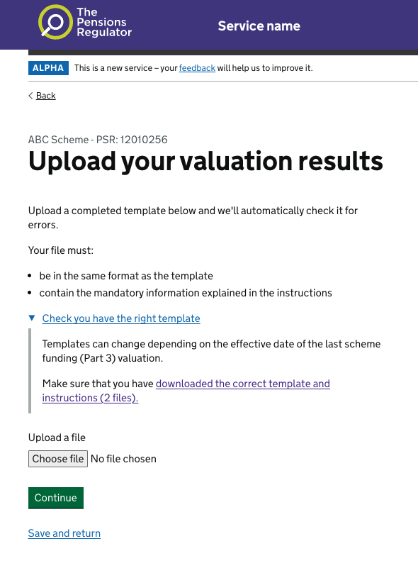

In Sprint 3 we iterated the prototype based on research findings from Sprint 2. These are the iterations we made.

## Adding 'This is a new service' pages

In Sprint 2 we gained a wider understanding of where this service will fit in the wider journey. Users will be accessing DVD from TPR's 'Exchange' service, which doesn't use GOV.UK Design patterns. As a result, we have choisen to add a 'This is a new service 'page to help users visually understand the change.

## Adding 'What's your valuation date' and moving the template

In Sprint 2 we gained a better understanding that the template used to upload data to the service will need to be based on the effective date of the most recent part 3 valuation. As policy changes in the future more data items might be requested, and the version of the template that users need to complete will be dependent on this date.

In user research sessions, several participants indicated that they would want access the template as soon as possible so they could use this in their wider process. As a result, we moved the download of the template to earlier in the flow.

## Adding scheme name and PSR number

We added the scheme name and PSR number to all pages, based on user feedback that it would be helpful to have a reminder on every page. To remain in line with GDS patterns, we kept this text left-aligned and designed it as a caption above a header. We made the caption text medium sized as opposed to the header in large size to assist with visual hierarchy and readability. We kept both name and PSR on one line, divided by a '-', to assist with visual hierarchy and readability.

## Changing information with TPR

In Sprint 2 we learned that a scheme address is not something that users would readily be able to find out or have access to, so we removed it from this iteration of the prototype.

In this version of the prototype we wanted to include more realistic data. We added a 'Is this the principal employer's name in full?' page to the prototype. We used the wording 'principal employer's name in full' as we discovered that wording during language mapping. We initially offered  a'Yes' option to continue in the flow, and two 'No' options - to change it in this service, or to contact us. However, internal users and stakeholders confirmed that in the event that the employer's name changed then users would be expected to notify TPR immediately, and that they should not be able to alter it in the scheme return. If the employer's name was incorrect, then users should contact TPR to discuss this rather than continuing in the service.

We also added a question page to check the chair of trustees' details, in line with language mapping. 

## Upload your valuation results

Testing revealed that some users confused the details component with a link. This was initially removed to avoid confusion, but was added back in when more information about the potential for templates to change was needed. This should be tested in the next round of usability testing.

We changed the button text to help reduce confusion around when a document is acutally uploaded

We changed the 'column' and 'row' columns to a single column, 'cell', based on user research.

We added a download link based on <a href="https://components.publishing.service.gov.uk/component-guide/attachment">the GOV.UK Component Guide.</a> We changed the colour of the .svg so it meets contrast accessibility requirements.

Something we discussed from the research findings was that the 'there is the problem' page will most likely have mutiple different dynamic states based on the error type:

- too many errors to display on the screen
- using the wrong version of the template
- below 10 errors we can display them on the screen

This is a low priority to design in Sprint 4

## Adding 'who is submitting the valuation?'

We added a page asking for the name and address of the person submitting the valuation. The current service asks for the details of the person completing the scheme return, and we want to test if users would be happy providing similar information for the valuation. We received some feedback from stakeholders that the address may not be the most appropriate information to request, and we hope to clarify this when we have more details about the data items we will be requesting.

We used the address lookup pattern from DWP as we assessed it to be more usable and accessible than other lookups.